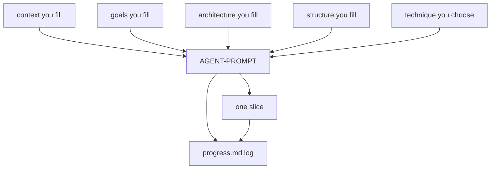

# Agent project template

This folder is a starting kit for building a project with an agent. You keep one file per concern. The agent reloads those files, implements one slice at a time, and writes progress to a log. It does not need a second copy of the same facts.

The method behind the kit is in [METHODS.md](METHODS.md). The short version: write the intended behavior before coding, keep each document editable when the chosen technique allows it, and prove each slice with a check you can run. Waterfall, agile, and extreme programming are gates on that loop, selected in one file.

This template does not contain an application.

## What you fill

Replace every `{{FILL: ...}}` token, including the braces. You fill five files. You do not copy them into the prompt.

| Order | File | What you are deciding |
| --- | --- | --- |
| 1 | [context.template.md](context.template.md) | Persistent context: who it is for, domain facts, constraints, glossary, and out-of-bounds work. |
| 2 | [goals.template.md](goals.template.md) | Outcomes with IDs (`G-001`), an acceptance check, delivery order, and `now` or `later`. |
| 3 | [architecture.template.md](architecture.template.md) | Context and container diagrams, parts, stack, decisions, and at most one book-rule path. |
| 4 | [structure.template.md](structure.template.md) | Directory tree, which part owns each path, and the build, run, and test commands. |
| 5 | [method.template.md](method.template.md) | One technique: `spec-driven`, `waterfall`, `agile`, or `xp`. Slice size and who reviews. |

Read [METHODS.md](METHODS.md) before you choose the technique. You need to know the outcomes, the main parts, the tree, and the stack. You do not write the slice list. The first run of the prompt drafts `progress.md` from the `now` goals.

## Stage tracker

A later stage starts only when the earlier files no longer contain `{{FILL:`.

| Stage | Who | File | Ready when |
| --- | --- | --- | --- |
| 1 | You | `context.template.md` | Identity, users, domain facts, constraints, and out-of-bounds work are filled |
| 2 | You | `goals.template.md` | Every outcome you care about has an ID, one statement, and an acceptance check |
| 3 | You | `architecture.template.md` | Diagrams, parts, and at least one decision are filled. The design-rule path is one `.mini.md` or `none` |
| 4 | You | `structure.template.md` | The tree matches the parts. Build and run commands are filled |
| 5 | You | `method.template.md` | The technique is one of the four words, and the slice size and review rule are filled |
| 6 | Agent | [AGENT-PROMPT.md](AGENT-PROMPT.md) | It creates or updates `progress.md`, implements the next slice, and sets that row `green` or `red` |

## How to run it

1. Fill the five files in the order above.
2. Open an agent chat and tell it to follow `AGENT-PROMPT.md`.
3. On the first run it writes `progress.md` from the `now` goals and shows you the order before application code, except when you have already told a waterfall run to start the current phase.
4. Each later session reloads the five files and `progress.md`, then continues from the first row that is not `green`.
5. If a row is `red`, the agent stops. Fix the slice or edit the source file the technique allows. Do not start the next goal on top of a failure.

## What each file is for

- **Context** is what every session must remember.
- **Goals** are the outcomes and the checks. They are the backlog when the technique is agile or XP, and the locked scope when the technique is waterfall.
- **Architecture** is the shape you insist on. Book rules under `user resources/agent-rules-books/` are optional coding bias, not this plan. See [user resources/HOW-TO-agent-rules-books.md](user resources/HOW-TO-agent-rules-books.md).
- **Structure** is where files go and which commands must succeed.
- **Progress** (`progress.md`, created by the agent) is the log. If it disagrees with a source file, the source file wins.
- **Technique** decides when those source files may change and what a slice must contain. The gates are inside `AGENT-PROMPT.md`.

## Optional setup: Git Bash on Windows

Cursor on Windows often uses PowerShell, which may not report that a command finished.

1. Open the command palette: `Ctrl-Shift-P`.
2. Run **Terminal: Select Default Profile**.
3. Choose **Git Bash**.

## Reusing this folder

Delete `progress.md` and any application code from the last product. Overwrite the five templates so they describe only the next project. Leave `AGENT-PROMPT.md` and `METHODS.md` as they are unless you are changing the kit itself.

`prompts/` is not part of this workflow. See [prompts/README.md](prompts/README.md).
