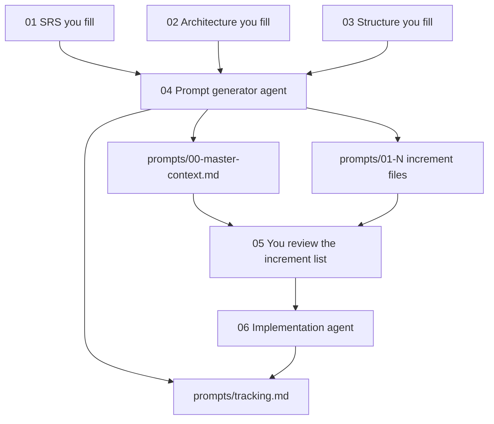

# MoT project template

This folder is a Cursor workflow for building a project from sequenced prompts. The method is [Module of Thought_instr.md](Module of Thought_instr.md): a master context document, one verifiable capability per increment, critical checkpoints chosen before the build, and a tracking matrix.

You write the requirements, the architecture, and the structure. A generator session turns those into prompt files. A later session implements the prompt files in order. This template does not contain an application.

## What you fill

You fill three files, in order. Replace each `{{FILL: ...}}` token, including the braces. Leave a field blank only by writing `none`, and only in a section that allows it.

| Order | File | What you are deciding |
| --- | --- | --- |
| 1 | [srs.template.md](srs.template.md) | What the system must do, for whom, and how you will know. No class names, no prompt filenames, no directory tree. |
| 2 | [architecture.template.md](architecture.template.md) | The general shape: users and external systems, the main parts and their jobs, the stack, the hard constraints, and one to three decisions you are not leaving to the agent. Optional: one book rule path. |
| 3 | [structure.template.md](structure.template.md) | The directory tree, which architecture part owns each path, and the build, run, and failure commands. |

You do not copy those facts into the agent prompts. [prompt-generator.template.md](prompt-generator.template.md) and [implementation-guide.template.md](implementation-guide.template.md) read the three files.

You need to know the product well enough to write testable requirement rows (`SRS-FR-001`, `SRS-NFR-001`), to name the main parts, and to choose a tree and a stack. You do not need to write the increment list. The generator does that, and you review it before implementation.

## Stage tracker

A stage is ready only when its check passes. An agent prompt must stop if an earlier file still contains `{{FILL:`.

| Stage | Who | File | Ready when |
| --- | --- | --- | --- |
| 1 | You | `srs.template.md` | Every must-have requirement has an ID, one testable statement, and a verification |
| 2 | You | `architecture.template.md` | Context, containers, and decisions are filled. The design-rule path is a single `.mini.md` file or `none` |
| 3 | You | `structure.template.md` | The directory tree and the ownership table match the architecture parts. Build and run commands are filled |
| 4 | Agent | `prompt-generator.template.md` | It writes `prompts/00-master-context.md`, numbered increments, and `prompts/tracking.md`. It does not write application code |
| 5 | You | `prompts/` | The increment list covers the SRS IDs and does not add parts you did not name |
| 6 | Agent | `implementation-guide.template.md` | It runs the increments in filename order, updates `prompts/tracking.md`, and cites SRS IDs |

## How to run it

1. Fill `srs.template.md`, then `architecture.template.md`, then `structure.template.md`.
2. Open a Cursor Agent chat. Point it at `prompt-generator.template.md`. It reads your three files and `Module of Thought_instr.md`, then writes the `prompts/` files. It must not implement the app.
3. Read `prompts/00-master-context.md` and the increment filenames. Confirm every SRS ID is covered and no new part appears. Edit the prompt files if something is wrong. Do not start implementation until this review is done.
4. Open a new Agent chat. Point it at `implementation-guide.template.md` and the `prompts/` folder. It loads the master context, runs the increment files in order, and updates `prompts/tracking.md` after each one.
5. If a row goes red, the agent stops and follows the isolation steps in `Module of Thought_instr.md`. If a later prompt contradicts an earlier one, fix the prompt file, then rerun from that increment.

The agent must not invent a requirement, a part, or a folder that your three files do not name.

## Where generated files go

`prompts/` starts without step files. See [prompts/README.md](prompts/README.md).

| Generated file | Role |
| --- | --- |
| `prompts/00-master-context.md` | Prompt 0. Reload this at the start of every implementation session |
| `prompts/01-....md` | One capability each. Filename order is execution order |
| `prompts/tracking.md` | Increment, SRS IDs, status, and green / yellow / red |

## Design rules from books

Book-derived rules live in `user resources/agent-rules-books/`. They are optional implementation bias, not the architecture plan. The verdict is in [user resources/ARCHITECTURE-NOTES.md](user resources/ARCHITECTURE-NOTES.md). How to attach the one file you named is in [user resources/HOW-TO-agent-rules-books.md](user resources/HOW-TO-agent-rules-books.md).

## Optional setup: Git Bash as the default terminal

Cursor on Windows often uses PowerShell. PowerShell may not report that a terminal command finished, so the agent keeps waiting.

1. Open the command palette: `Ctrl-Shift-P`.
2. Run **Terminal: Select Default Profile**.
3. Choose **Git Bash** (Git for Windows provides it).

New agent terminals then use Git Bash. This is a one-time editor setting, not part of the project files.

## What not to leave in

When you reuse this folder, delete generated files under `prompts/` except `prompts/README.md`. Overwrite the three templates so they describe only the project you are about to build. Do not leave an earlier product's requirement rows, part names, or commands in those files.
