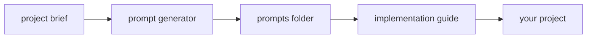

# MoT project template

This folder is a Cursor workflow for building a project from sequenced prompts. MoT here means the prompt pattern in the templates: critical requirements at the start and end of each prompt, `MANDATORY` and `CRITICAL` markers, bold text and code blocks, `###` sections, and only the context that one component needs.

You fill in a project brief. Cursor writes one prompt per component, then a second session implements those prompts in order. This template does not contain an application.

## What to copy

For a new project, copy these three files into that project's folder (or fill them in place if this folder is the new project):

| File | Role |
| --- | --- |
| `project-brief.template.md` | The only sheet you fill by hand |
| `prompt-generator.template.md` | Agent prompt that writes step files into `prompts/` |
| `implementation-guide.template.md` | Agent prompt that runs those files in order |

`prompts/` is where the generated step files land. See `prompts/README.md`.

Every blank uses the form `{{FILL: name}}`. Replace the whole token, including the braces, with your text.

## What to fill

Open `project-brief.template.md` and replace each field:

1. **Name** — short project name used in the other two templates.
2. **Goal** — one paragraph: what it does and who it is for.
3. **Stack** — language, runtime, frameworks, and build tool.
4. **Hard constraints** — rules the agent must not break (scope limits, required libraries, formats).
5. **Ordered components** — one line per prompt. Put project setup and dependencies first. Then one component per line. The filename (`01-....md`) is the file the generator must write.
6. **Directory layout** — the tree the finished project must match.
7. **Build and test commands** — the build that must succeed, the command that starts the app, and any extra checks.
8. **Done criteria** — behavior you can observe when it works.
9. **Architecture check** — each major part and its job.
10. **If the build fails** — checks that match this stack.

Then copy the same values into the matching `{{FILL: ...}}` spots in `prompt-generator.template.md` and `implementation-guide.template.md`. The implementation guide's numbered list must use the same filenames and order as the brief.

Leave domain names, sample type lists, and sample behavior from any earlier project out of these files.

## How to use

1. Fill `project-brief.template.md`.
2. Open a Cursor Agent chat. Attach or point it at the filled brief and `prompt-generator.template.md`. Tell it to follow that generator file. It should write one markdown file per component into `prompts/` and should not implement the app.
3. Copy those filenames into `implementation-guide.template.md` in the same order. Fill the rest of that guide from the brief (commands, layout, done criteria).
4. Open a new Agent chat. Point it at `implementation-guide.template.md` and the `prompts/` folder. It runs the prompts in order. After each prompt, fix errors from that step before the next one. When the list is done, run the brief's build and run commands and check the done criteria.

If a later prompt contradicts an earlier one, fix the prompt file, then rerun from that step. Do not let the agent invent components that are not in the brief.

## Optional setup: Git Bash as the default terminal

Cursor on Windows often uses PowerShell. PowerShell may not report that a terminal command finished, so the agent keeps waiting.

1. Open the command palette: `Ctrl-Shift-P`.
2. Run **Terminal: Select Default Profile**.
3. Choose **Git Bash** (Git for Windows provides it).

New agent terminals then use Git Bash. This is a one-time editor setting, not part of the project files.

## User resources

Optional software-development notes and agent rule packs live in `user resources/`.

- Book-derived Cursor/Codex/Claude rules: `user resources/agent-rules-books/`
- How to use them with this MoT workflow: `user resources/HOW-TO-agent-rules-books.md`

## What not to leave in

When you reuse this folder, delete or overwrite anything that names a previous product: sample class or module lists, sample screens, sample operations, and old build commands. The templates should describe only the project you are about to build.
