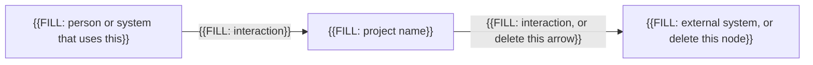
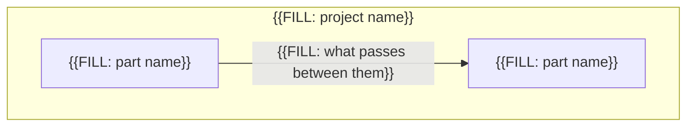

# Architecture

You fill this file. It is stage 2 of the workflow in `README.md`.

Replace every `{{FILL: ...}}` token, including the braces. This file is the general shape of the system: who it talks to, the main parts, the stack, and the decisions you are not leaving to the agent.

Do not list prompt filenames here. Do not restate each requirement; cite `SRS-FR-` and `SRS-NFR-` IDs from `srs.template.md` when a decision exists to satisfy one.

Fill this only after `srs.template.md` has no remaining `{{FILL:` tokens.

## Required: Context

The C4 context view: the people and external systems around this software. Replace the labels. Delete a node that does not exist rather than leaving a token in it.

## Required: Containers

The C4 container view: the main runnable or deployable parts inside the software, and how they call each other. These names must match the part list below.

Add nodes for every part you list below. Remove nodes you do not have.

## Required: Parts

Name each major part and its job. Every part in the container diagram appears here. The agent must not add a part that is not in this list.

- **{{FILL: part name}}**: {{FILL: responsibility}}
- **{{FILL: part name}}**: {{FILL: responsibility}}

## Required: Stack

Language, runtime, frameworks, and build tool.

{{FILL: stack}}

## Required: Hard constraints

Rules the agent must not break. Examples: a library you require, a format you require, work that is forbidden even if an SRS row could be read that way.

- {{FILL: hard constraint}}

## Required: Decisions

Record one to three decisions you have already made. Delete the unused decision blocks, or leave them only if you replace every token. The agent must follow these and must not invent a competing architecture.

### Decision 1

- **Context**: {{FILL: the force that required a choice}}
- **Decision**: {{FILL: what you chose}}
- **Rejected**: {{FILL: what you did not choose, and why}}
- **SRS IDs**: {{FILL: IDs this decision serves, or none}}

### Decision 2

- **Context**: {{FILL: the force that required a choice, or delete this decision}}
- **Decision**: {{FILL: what you chose, or delete this decision}}
- **Rejected**: {{FILL: what you did not choose, or delete this decision}}
- **SRS IDs**: {{FILL: IDs this decision serves, or delete this decision}}

### Decision 3

- **Context**: {{FILL: the force that required a choice, or delete this decision}}
- **Decision**: {{FILL: what you chose, or delete this decision}}
- **Rejected**: {{FILL: what you did not choose, or delete this decision}}
- **SRS IDs**: {{FILL: IDs this decision serves, or delete this decision}}

## Required: Primary design rule

During implementation, the agent may read one book rule file from `user resources/agent-rules-books/`. That file biases how code is written inside the boundaries above. It is not a second architecture.

Write one path ending in `.mini.md`, or write `none`.

Examples of a single valid path (pick at most one):

- `user resources/agent-rules-books/clean-architecture/clean-architecture.mini.md`
- `user resources/agent-rules-books/clean-code/clean-code.mini.md`
- `user resources/agent-rules-books/domain-driven-design-distilled/domain-driven-design-distilled.mini.md`

See `user resources/HOW-TO-agent-rules-books.md` and `user resources/ARCHITECTURE-NOTES.md` before choosing. Do not list two books.

{{FILL: one mini.md path, or none}}
