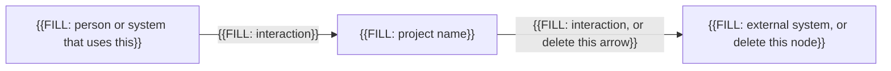
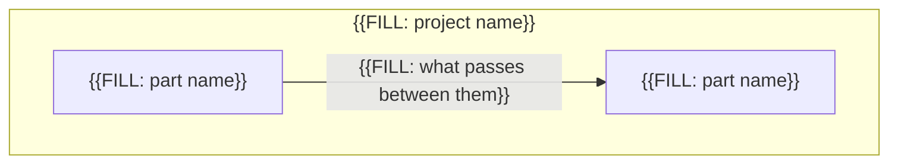

# Architecture

You fill this file. It is the general shape: context, main parts, stack, and decisions you are not handing to the agent.

Replace every `{{FILL: ...}}` token, including the braces. Cite goal IDs when a decision exists to serve a goal. Do not restate every goal.

Under spec-driven increments, agile, and extreme programming, add a decision when you make it. Under waterfall, finish the decisions you intend to lock before implementation starts.

## Context

People and external systems around this software. Delete a node you do not have.

## Containers

The main parts inside the software. Names here must match the part list.

## Parts

The agent must not add a part that is not listed here.

- **{{FILL: part name}}**: {{FILL: responsibility}}
- **{{FILL: part name}}**: {{FILL: responsibility}}

## Stack

{{FILL: language, runtime, frameworks, and build tool}}

## Decisions

One to three decisions you have already made. Delete unused blocks.

### Decision 1

- **Context**: {{FILL: the force that required a choice}}
- **Decision**: {{FILL: what you chose}}
- **Rejected**: {{FILL: what you did not choose, and why}}
- **Goals**: {{FILL: goal IDs, or none}}

### Decision 2

- **Context**: {{FILL: the force that required a choice, or delete this decision}}
- **Decision**: {{FILL: what you chose, or delete this decision}}
- **Rejected**: {{FILL: what you did not choose, or delete this decision}}
- **Goals**: {{FILL: goal IDs, or delete this decision}}

## Primary design rule

Optional. One path ending in `.mini.md` under `user resources/agent-rules-books/`, or `none`. The implementation session may read that one file. It is not a second architecture. See `user resources/HOW-TO-agent-rules-books.md`.

{{FILL: one mini.md path, or none}}
